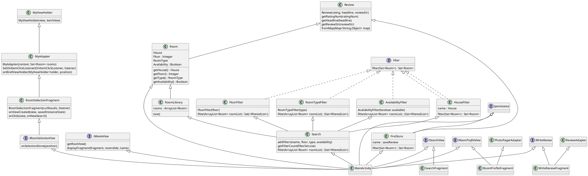
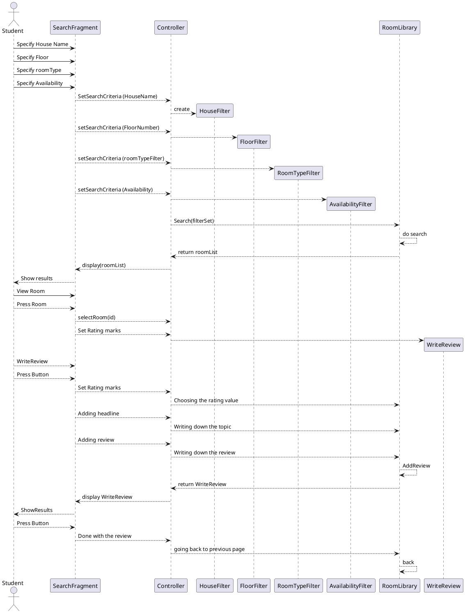
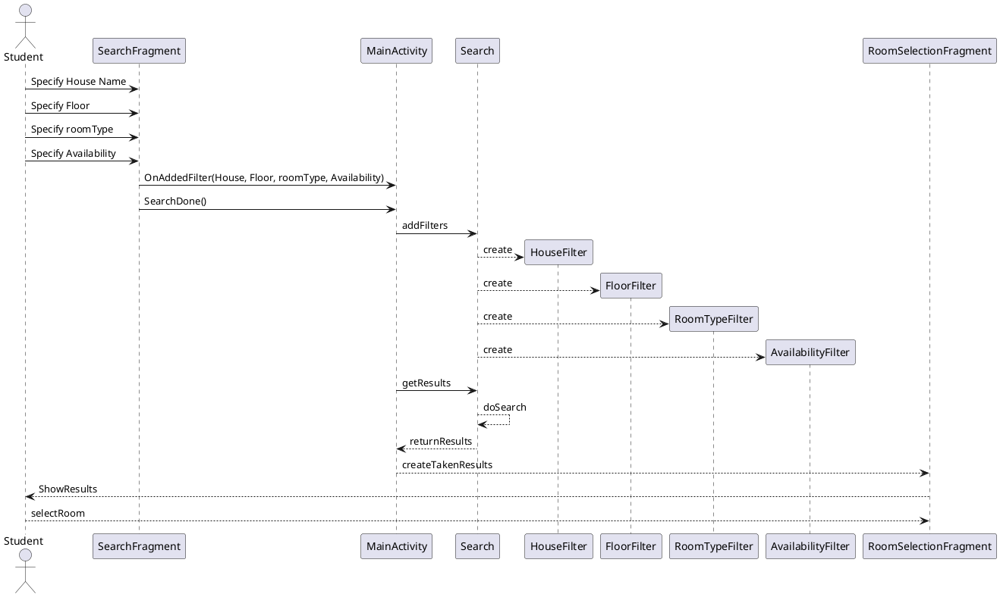

# Design

## Design Class Diagram

```plantuml
@startuml

class Room 
Review <|-- Room
Room : House
Room : Floor : Integer
Room : RoomType
Room : Availability : Boolean
Room : getHouse() : House
Room : getFloor() : Integer
Room : getType() : RoomType
Room : getAvailability() : Boolean

class FireStore 
Filter <|.. HouseFilter
FireStore : name : saveReview
FireStore : filter(Set<Room>) : Set<Room>
Review <|-- FireStore
Review : Review(rating, headline, reviewStr)
Review : getRatingNum(ratingNum)
Review : getHeadline(headline)
Review : getReviewStr(reviewStr)
Review : fromMap(Map<String,Object> map)
Ipersistance <|-- FireStore


class RoomLibrary
Room <|-- RoomLibrary
RoomLibrary : rooms : ArrayList<Room>
RoomLibrary : size()

interface Filter
Filter : filter(Set<Room>) : Set<Room>

interface Ipersistance
Ipersistance <|-- MainActivity 

interface ISearchView
ISearchView <|-- MainActivity
ISearchView <|-- SearchFragment 

interface IRoomSelectionView
IRoomSelectionView <|-- MainActivity
IRoomSelectionView : onSelectionDone(position)
RoomSelectionFragment <|-- IRoomSelectionView 
RoomSelectionFragment : RoomSelectionFragment(curResults, listener)
RoomSelectionFragment : onViewCreated(view, savedInstanceState)
RoomSelectionFragment : onClick(view, onNewSearch)
MyAdapter <|-- RoomSelectionFragment
MyAdapter : MyAdapter(context, Set<Room> rooms)
MyAdapter : SetOnItemClickListener(OnItemClickListener, listener)
MyAdapter : onBindViewHolder(MyViewHolder holder, position)

MyViewHolder <|-- MyAdapter
MyViewHolder : MyViewHolder(view, itemView)

interface IRoomProfileView
IRoomProfileView <|-- MainActivity
IRoomProfileView <|-- RoomProfileFragment
PhotoPagerAdapter <|-- RoomProfileFragment

interface IWriteReview 
IWriteReview <|-- MainActivity
IWriteReview <|-- WriteReviewFragment
ReviewAdapter <|-- WriteReviewFragment

interface IManinView
IManinView <|-- MainActivity
IManinView : getRootView()
IManinView : displayFragment(fragment, reversible, name)

class HouseFilter
Filter <|.. HouseFilter
HouseFilter : name : House
HouseFilter : filter(Set<Room>) : Set<Room>

class FloorFilter 
FloorFilter <|-- Search 
FloorFilter : FloorFilter(floor)
FloorFilter : filter(ArrayList<Room> roomList) : Set(<filteredList>)
Filter <|.. FloorFilter
RoomTypeFilter <|-- Search
RoomTypeFilter : RoomTypeFilter(type)
RoomTypeFilter : filter(ArrayList<Room> roomList) : (Set<filteredList>)
Filter <|.. RoomTypeFilter
AvailabilityFilter <|-- Search
AvailabilityFilter : AvailabilityFilter(boolean available)
AvailabilityFilter : filter(ArrayList<Room> roomList) : (Set<filteredList>)
Filter <|.. AvailabilityFilter 
HouseFilter <|-- Search

RoomLibrary <|-- Search
Search <|-- MainActivity
Search : addFilters(name, floor, type, availability)
Search : getFilterCount(filterSet.size)
Search : filter(ArrayList<Room> roomList) : (Set<filteredList>)
Room <|-- MainActivity
FireStore <|-- MainActivity

@enduml
```

```plantuml
@startuml
actor Student
Student -> SearchFragment: Specify House Name 
Student -> SearchFragment: Specify Floor
Student -> SearchFragment: Specify roomType
Student -> SearchFragment: Specify Availability
SearchFragment --> Controller: SetSearchCriteria (HouseName) 
create HouseFilter
Controller --> HouseFilter: create 
SearchFragment --> Controller: setSearchCriteria (FloorNumber)
create FloorFilter 
Controller --> FloorFilter
SearchFragment --> Controller: setSearchCriteria (roomTypeFilter)
create RoomTypeFilter 
Controller --> RoomTypeFilter 
SearchFragment --> Controller: setSearchCriteria (Availability)
create AvailabilityFilter 
Controller --> AvailabilityFilter
Controller --> RoomLibrary: Search(filterSet)
RoomLibrary --> RoomLibrary: do search  
RoomLibrary --> Controller: return roomList  
Controller --> SearchFragment: display(roomList) 
SearchFragment --> Student: Show results 
Student -> SearchFragment: View Room 
Student --> SearchFragment: Press Room 
SearchFragment --> Controller: selectRoom(id)
SearchFragment --> Controller: Set Rating marks
create WriteReview
Controller --> WriteReview
Student --> SearchFragment: WriteReview
Student --> SearchFragment: Press Button 
SearchFragment--> Controller: Set Rating marks 
Controller --> RoomLibrary: Choosing the rating value 
SearchFragment --> Controller: Adding headline
Controller --> RoomLibrary: Writing down the topic
SearchFragment --> Controller: Adding review 
Controller --> RoomLibrary: Writing down the review 
RoomLibrary --> RoomLibrary: AddReview
RoomLibrary --> Controller: return WriteReview
Controller --> SearchFragment: display WriteReview
SearchFragment--> Student: ShowResults
Student --> SearchFragment: Press Button
SearchFragment --> Controller: Done with the review
Controller --> RoomLibrary: going back to previous page
RoomLibrary --> RoomLibrary: back
@enduml
```

```plantuml
@startuml
actor Student
Student -> SearchFragment: Specify House Name 
Student -> SearchFragment: Specify Floor
Student -> SearchFragment: Specify roomType
Student -> SearchFragment: Specify Availability
SearchFragment -> MainActivity: OnAddedFilter(House, Floor, roomType, Availability)
SearchFragment -> MainActivity: SearchDone()
MainActivity -> Search: addFilters 
create HouseFilter
Search --> HouseFilter: create 
create FloorFilter 
Search --> FloorFilter: create
create RoomTypeFilter 
Search --> RoomTypeFilter :create
create AvailabilityFilter 
Search --> AvailabilityFilter: create
MainActivity -> Search: getResults 
Search --> Search: doSearch 
Search --> MainActivity: returnResults 
MainActivity --> RoomSelectionFragment: createTakenResults
RoomSelectionFragment --> Student: ShowResults 
Student --> RoomSelectionFragment: selectRoom 


@enduml
```