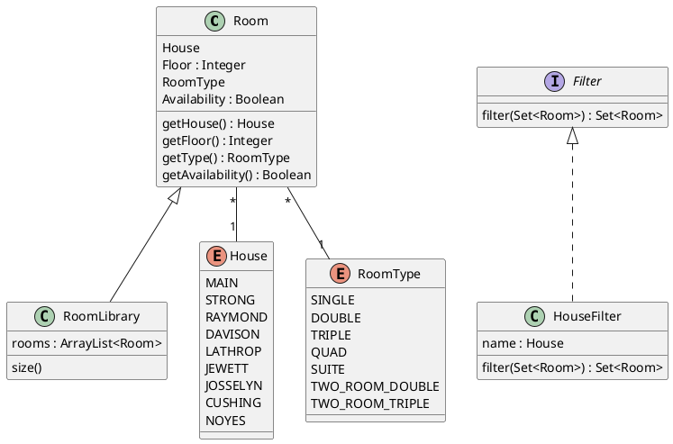
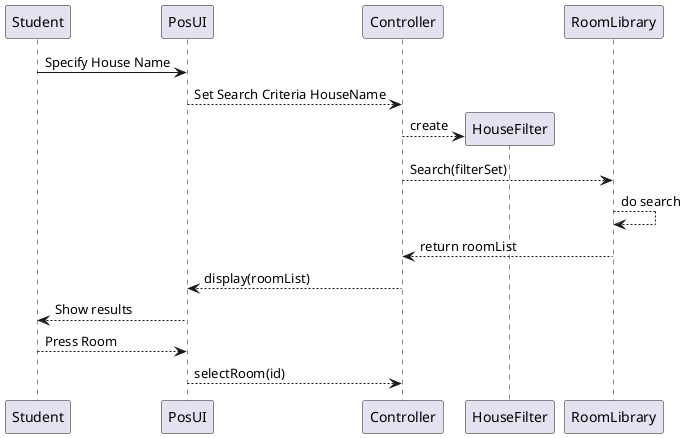

# Design

## Design Class Diagram

```plantuml
@startuml

class Room
Room : House
Room : Floor : Integer
Room : RoomType
Room : Availability : Boolean
Room : getHouse() : House
Room : getFloor() : Integer
Room : getType() : RoomType
Room : getAvailability() : Boolean


class RoomLibrary
Room <|-- RoomLibrary
RoomLibrary : rooms : ArrayList<Room>
RoomLibrary : size()

enum House
Room "*" -- "1" House
House : MAIN
House : STRONG
House : RAYMOND
House : DAVISON
House : LATHROP
House : JEWETT
House : JOSSELYN
House : CUSHING
House : NOYES

enum RoomType
Room "*" -- "1" RoomType
RoomType : SINGLE
RoomType : DOUBLE
RoomType : TRIPLE
RoomType : QUAD
RoomType : SUITE
RoomType : TWO_ROOM_DOUBLE
RoomType : TWO_ROOM_TRIPLE

interface Filter
Filter : filter(Set<Room>) : Set<Room>

class HouseFilter
Filter <|.. HouseFilter
HouseFilter : name : House
HouseFilter : filter(Set<Room>) : Set<Room>

@enduml
```

```plantuml
@startuml
Student -> PosUI: Specify House Name 
PosUI --> Controller: Set Search Criteria HouseName  
create HouseFilter 
Controller --> HouseFilter: create 
Controller --> RoomLibrary: Search(filterSet)
RoomLibrary --> RoomLibrary: do search  
RoomLibrary --> Controller: return roomList  
Controller --> PosUI: display(roomList) 
PosUI --> Student: Show results 
Student --> PosUI: Press Room 
PosUI --> Controller: selectRoom(id)

@enduml
```