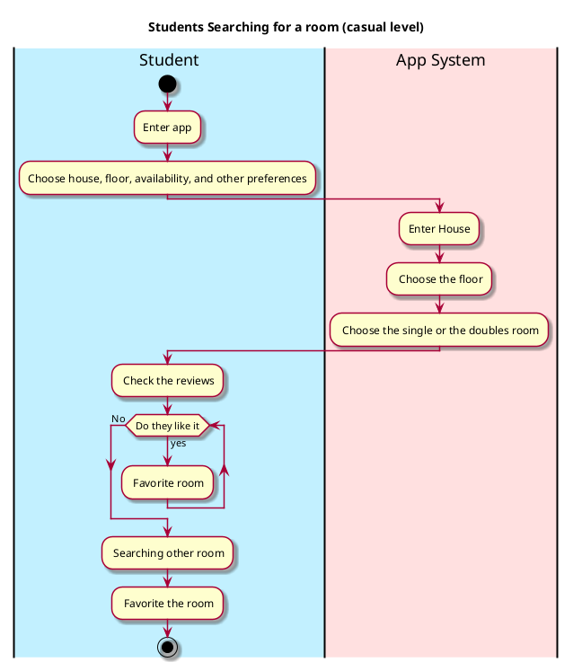

# Use case name, Searching for a room

## 1. Primary actor and goals
--Students--:- Their goals are to search for a room that accompany them the most like how big is that or is it a single or not.

## 2. Other stakeholders and their goals

* __Customer__: Wants fast service with minimal effort. Wants easily visible display of entered items and prices. Wants proof of purchase to support returns.
* __Government tax agencies__: Want to collect correct amount of tax from every sale. There may be multiple agencies involved, e.g., at the federal, state, and county levels.

## 2. Preconditions

What must be true prior to the start of the use case.
For example, for _-Students searching for a room_:

* Students enroll to the school and identified.

## 4. Postconditions

What must be true upon successful completion of the use case.
For example, for _Students search for a room_:

* Room is available.
* Saved the favourite rooms.
* Show the recent reviewed rooms.
* show the most high viewed rooms.

## 4. Workflow

The sequence of steps involved in the execution of the use case, in the form of one or more activity diagrams (please feel free to decompose into multiple diagrams for readability).

The workflow can be specified at different levels of detail:

* __Brief__: main success scenario only;
* __Casual__: most common scenarios and variations;
* __Fully-dressed__: all scenarios and variations.

Please be sure indicate what level of detail the workflow you include represents.

For example, for _process sale_:

