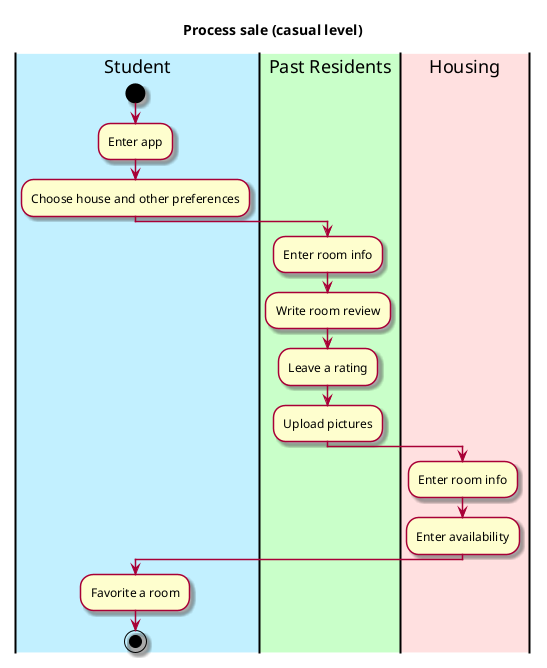

# Use case name, e.g., process sale

## 1. Primary actor and goals
Who is the main interested party and what goal(s) this use case is designed to help them achieve. For example, for _process sale_:

__Cashier__: wants to sell items to a customer. Wants accurate, fast data entry, and no payment errors, as cash drawer shortages are deducted from their salary.

## 2. Other stakeholders and their goals

* __Customer__: Wants fast service with minimal effort. Wants easily visible display of entered items and prices. Wants proof of purchase to support returns.
* __Government tax agencies__: Want to collect correct amount of tax from every sale. There may be multiple agencies involved, e.g., at the federal, state, and county levels.

## 2. Preconditions

What must be true prior to the start of the use case.
For example, for _process sale_:

* Cashier is identified and authenticated.

## 4. Postconditions

What must be true upon successful completion of the use case.
For example, for _process sale_:

* Sale is saved.
* Tax is correctly calculated.
* Receipt is generated.
* Payment authorization approvals are recorded.

## 4. Workflow

The sequence of steps involved in the execution of the use case, in the form of one or more activity diagrams (please feel free to decompose into multiple diagrams for readability).

The workflow can be specified at different levels of detail:

* __Brief__: main success scenario only;
* __Casual__: most common scenarios and variations;
* __Fully-dressed__: all scenarios and variations.

Please be sure indicate what level of detail the workflow you include represents.

For example, for _process sale_:

