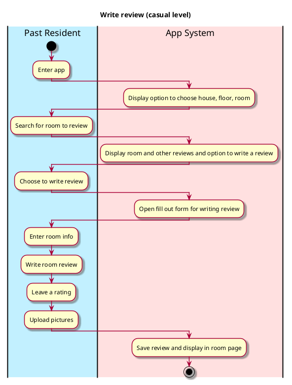

# Write Review

## 1. Primary actor and goals
Who is the main interested party and what goal(s) this use case is designed to help them achieve. For example, for _process sale_:

__Past/Current Resident__: wants to add useful information about the room they lived in to help students know how the room looks like and what past residents liked (or disliked) about it. Wants easy, organized way to write review, upload pictures and rate room.

## 2. Other stakeholders and their goals

* __Student searching for room__: Wants useful, organized information. Wants easily visible display of reviews, photos, ratings, and availability. Wants verified, accurate information to base their decisions on.
* __?__: 

## 2. Preconditions

What must be true prior to the start of the use case.

* Past/current resident is a Vassar student and has stayed in the room they are reviewing.

## 4. Postconditions

What must be true upon successful completion of the use case.

* Review is saved.
* Review is visible/accessible to everyone.
* ?

## 4. Workflow

The sequence of steps involved in the execution of the use case, in the form of one or more activity diagrams (please feel free to decompose into multiple diagrams for readability).

The workflow can be specified at different levels of detail:

* __Brief__: main success scenario only;
* __Casual__: most common scenarios and variations;
* __Fully-dressed__: all scenarios and variations.

Please be sure indicate what level of detail the workflow you include represents.

For example, for _process sale_:

